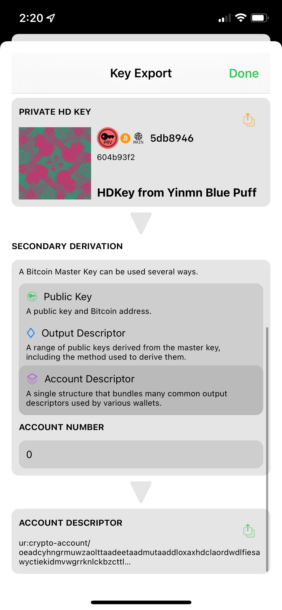
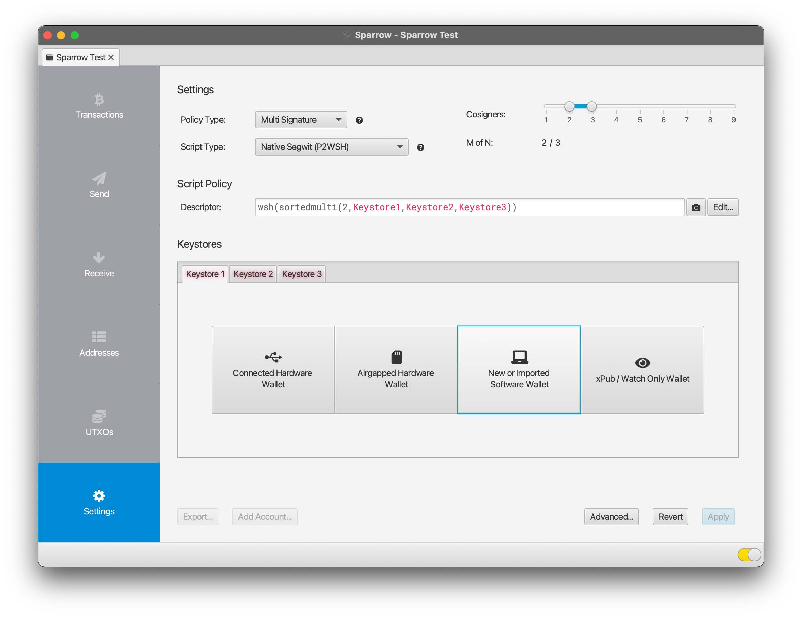
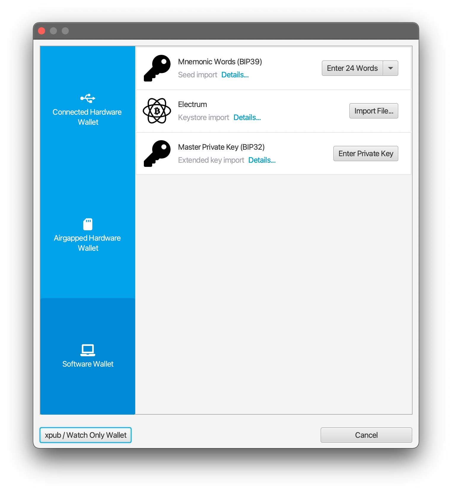
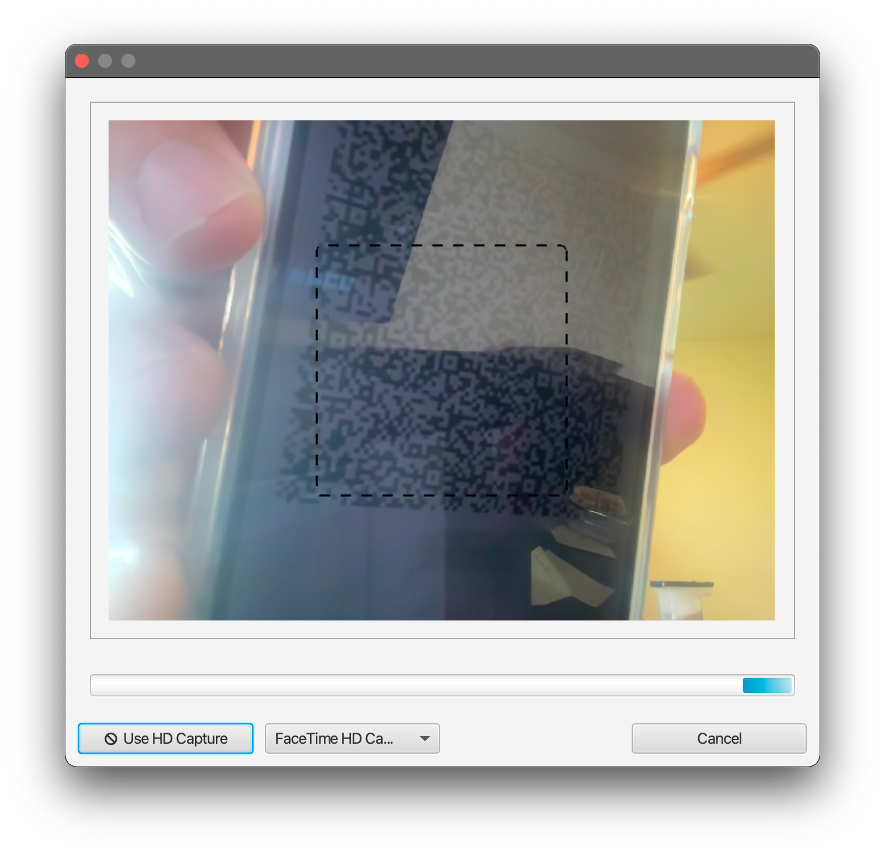
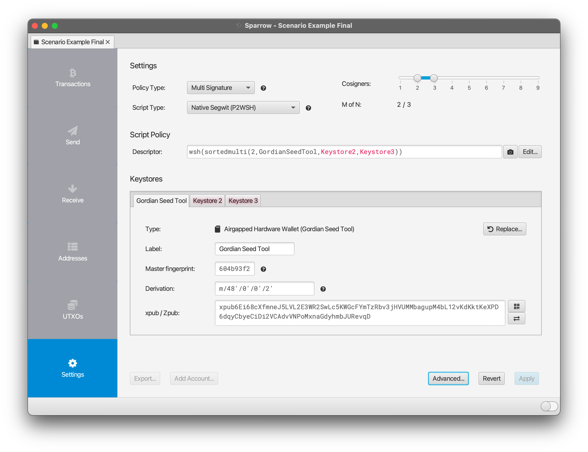

# Integrating Seed Tool with Other Apps

One of the primary goals of **Gordian Seed Tool** is to demonstrate how seeds can be stored in a closely held device while simultaenously being used by online wallets. This allows for the secure and resilient storage of your seeds while  maintaining high usability.

There are two primary ways to do this: a seed can be stored in **Gordian Seed Tool**, then specific key derivations can be released as needed; or the seed can be stored in **Seed Tool** and it can be used to sign PSBTs as required. These methods are both described in the [Gordian Seed Tool Manual](https://github.com/BlockchainCommons/GordianSeedTool-iOS/blob/master/Docs/MANUAL.md). The latter is more secure.

## Using Sparrow as a Transaction Coordinator

[Sparrow](https://sparrowwallet.com/) is a self-sovereign software wallet created by [Craig Raw](https://github.com/craigraw) that is using some of Blockchain Commons' [Uniform Resources](https://github.com/BlockchainCommons/crypto-commons/blob/master/Docs/ur-1-overview.md).

The following examples demonstrate how to use Sparrow Wallet as a "transaction coordinator", where it manages the usage of keys, including at least one held by **Seed Tool**, and the receipt and sending of funds, but doesn't hold any keys itself.

### Creating a Multisig Account on Sparrow

One of the best practices of [#SmartCustody](https://github.com/BlockchainCommons/SmartCustody) is to create a multisig account where each key for the wallet is held securely. In this case, all of the keys will be held on remote devices, with Sparrow simply acting to watch the multisig account, to create addresses, and to coordinate the creation of transactions for it.

To create a multisig account in Sparrow, select the "Create New Wallet" button or choose "File->New Wallet" from the menu bar. Enter a name for the Wallet and then choose a "Multi Signature" policy with a 2-of-3 M-of-N.

You can now create (or access) the first seed for your multisig in **Seed Tool**. Once you've done so, view the seed in **Seed Tool** and request the "Account Descriptor". This is accessed by selecting the "Authenticate" button and then "Derive Key"->"Other Key Derivations". Scroll down and you'll see "Secondary Derivations" for the "Master Key", which is where you select "Account Descriptor". Finally, touch the export icon for the Account Descriptor. This will give you an animated QR code that provides the xpubs for a variety of common key derivations.

<a href="../images/sparrow-multisig-1.jpg"></a>

In Sparrow you can import this as your "Keystore 1", the first of the three keys that will lock your wallet:

1. Select "Airgapped Hardware Wallet" for "Keystore 1".

<a href="../images/sparrow-multisig-2.jpg"></a>

2. There is then a specific option for "Gordian Seed Tool": choose "Scan".

<a href="../images/sparrow-multisig-3.jpg"></a>

3. Scan the Animated QR.

<a href="../images/sparrow-multisig-4.jpg"></a>

4. View your imported xpub. It should have a `m/48'/0'/0'/2'` derivation (for a Segwit multisig), a name, and a master fingerprint. 

<a href="../images/sparrow-multisig-5.jpg"></a>

Afterward, you will need to import or create two other seeds or HD keys as "Keystore 2" and "Keystore 3". The source for each of these keystores should be physically separated. One method to do so is to use one or more hardware devices. This is easily done with hardware wallets, which can be connected to your computer and their keystores imported as "Connected Hardware Wallet", or via newer "Airgapped Hardware Wallets" such Keystone or the Foundation Devices Passport. (If you do not have sufficient external devices, you might choose Sparrow for 1 of the 3 seeds, which can be done from "New or Imported Software Wallet", where you select "Mnemonic Words" and after you choose to "Enter 12 Words" or "Enter 24 Words", you click "Generate New". But this moves away from the core model of using Sparrow as a Transaction Coordinator: using two additional external devices is suggested, and having at least one more device is a requirement to ensure security.)

Once you have imported these additional keys, you should see a descriptor something like the following:
```
 wsh(sortedmulti(2,GordianSeedTool,TrezorT,LedgerNanoS))
```
You can then "Apply" to finalize your wallet. The "Receive" button will then reveal an address to which you can send funds.

At this point, you will generally want to separate your various keystores, since these hardware devices (and your phone) hold the actual seeds and private keys. If you used two hardware wallets with **Seed Tool** then you'll want to remove at least one of those hardware wallets (and maybe both, depending on how often you use transact Bitcoins) to secure, remote places. 

### Sending a PSBT on Sparrow

To create a transaction on Sparrow, you must select your wallet, choose to "Send", and enter basic info such as the address, a label, and the fee amount. You can then "Create Transaction" after which you can view information and will be given the option to "Finalize Transaction for Signing". You'll then be brought to a page where you're given the option to sign the transaction.

If you used the above methodology for creating a multisig while using Sparrow as a transaction coordinator, then you'll need your phone (with **Seed Tool**) and one or your two hardware devices to do so.

To sign with **Seed Tool**:

1. On Sparrow: choose "Show QR". This will display an animated QR.

<a href="../images/sparrow-psbt-1.jpg"></a>
<a href="../images/sparrow-psbt-2.jpg"></a>

2. On Seed Tool: choose the QR icon at the top and "Scan" the animated QR. You will be told that there is a Signature Request. Reveal the details. Currently Sparrow supplies a `ur:crypto-psbt`, though we encourage developers to upgrade to `ur:crypto-request`, our newer specification. See [our article on `crypto-request/response` vs `crypto-psbt`](https://github.com/BlockchainCommons/crypto-commons/blob/master/Docs/crypto-request-or-crypto-psbt.md) for why.

<a href="../images/sparrow-psbt-3.jpg"></a>

3. On Seed Tool: choose "Approve".

<a href="../images/sparrow-psbt-4.jpg"></a>

4. On Seed Tool: if the request was a `ur:crypto-request`, choose the QR Code for `ur:crypto-response`; if it was `ur:crypto-psbt`, choose a `ur:crypto-psbt`. This will display the QR.

<a href="../images/sparrow-psbt-5.jpg"></a>
<a href="../images/sparrow-psbt-6.jpg"></a>

5. On Sparrow: close the box displaying the original unsigned PSBT and click "Scan QR" to capture the QR you generated on Seed Tool after signing. After Sparrow reads in the animated PSBT (which might take a bit of time), you should see a box telling you that your transaction is signed by your Seed Tool key.

<a href="../images/sparrow-psbt-7.jpg"></a>

You can now input another signature; if you used the above methodology for creating a multisig, hook up the hardware device you have with your computer, and click "Sign" under the USB icon. Remember that you may need to unlock your hardware wallet with a PIN and/or choose the right app, depending on the precise hardware device. Once you've done so, click "Sign". You will probably then need to review and OK the signature on the device.

<a href="../images/sparrow-psbt-8.jpg"></a>

Finally, you can "Broadcast Transaction" on Sparrow.

You've sent a transaction using Sparrow as a transaction coordinator, with #SmartCustody ensured, because all three keys for the multisig are held remotely, one of them in **Gordian Seed Tool**.
