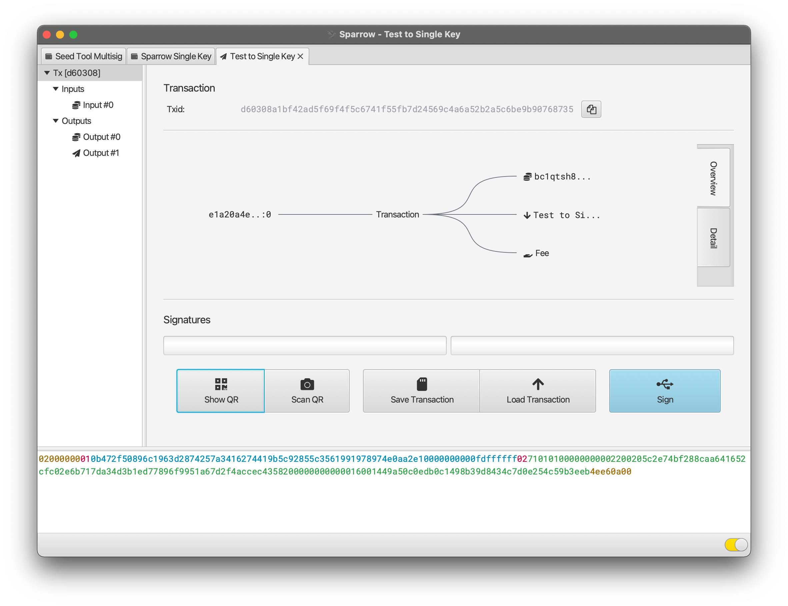
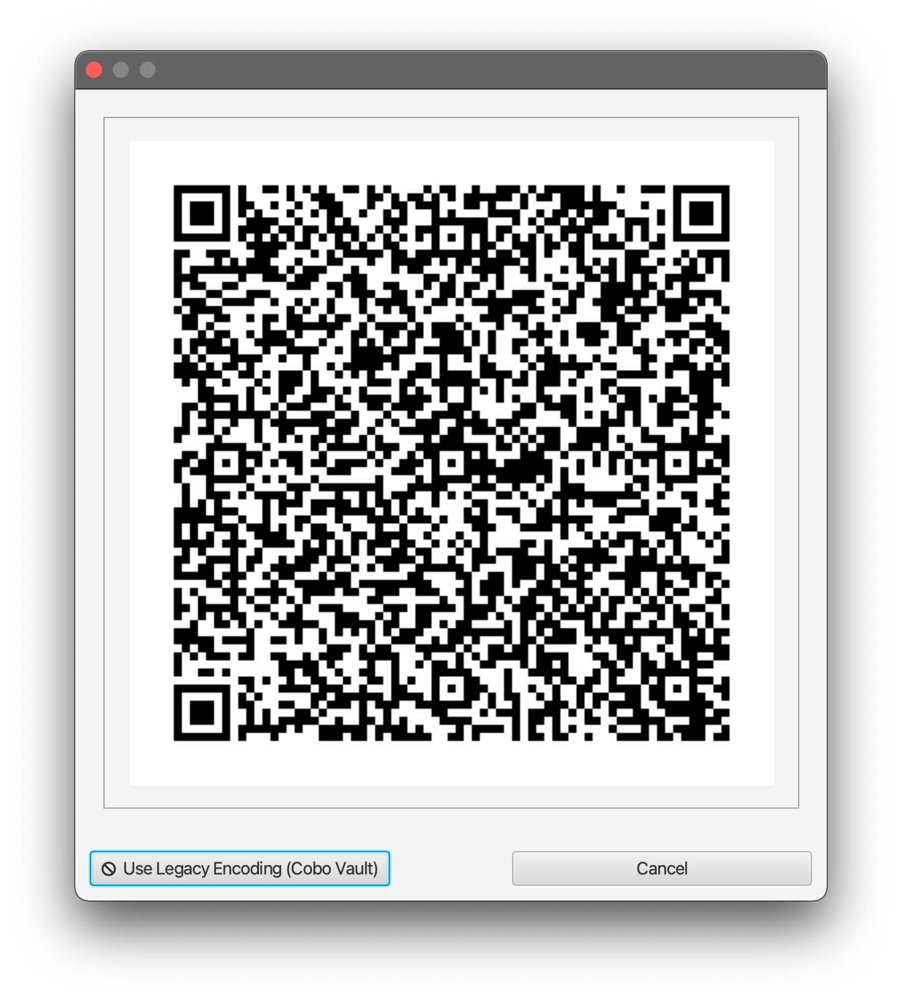
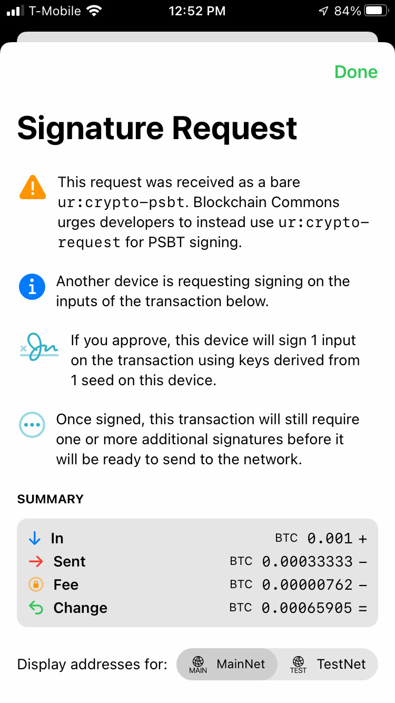
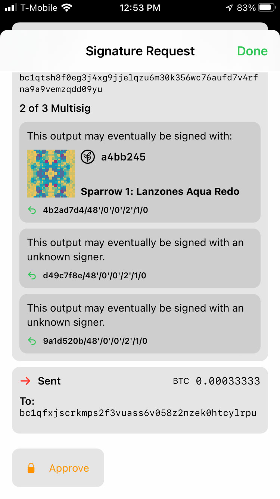
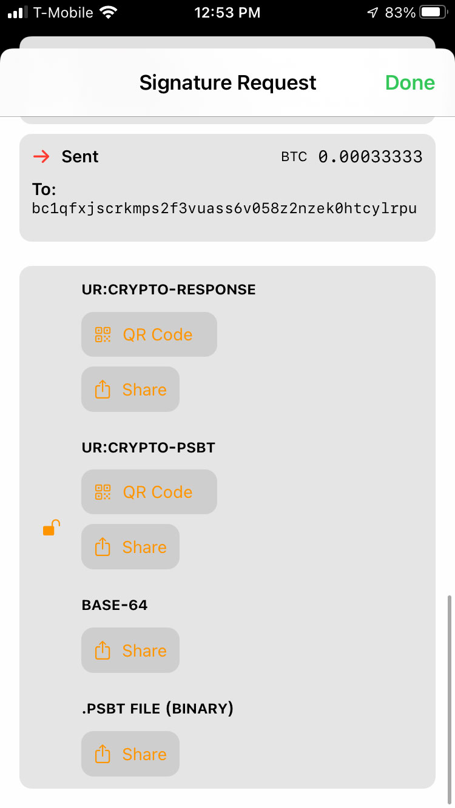
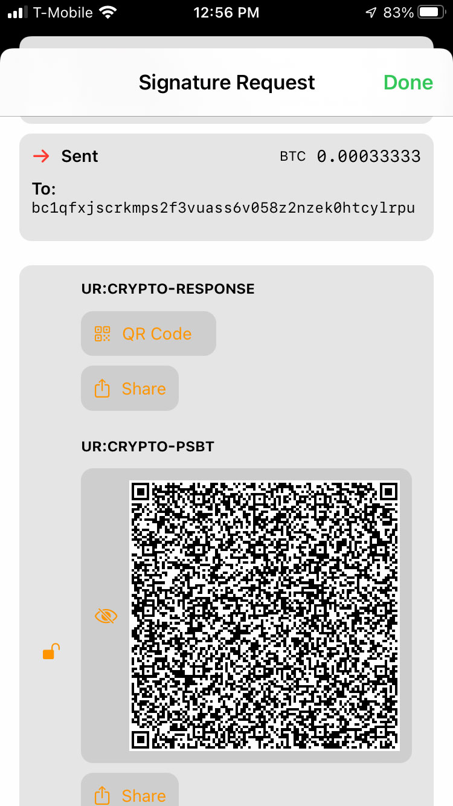
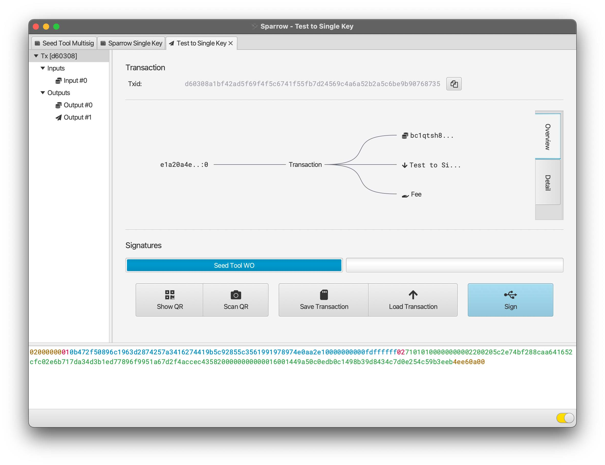
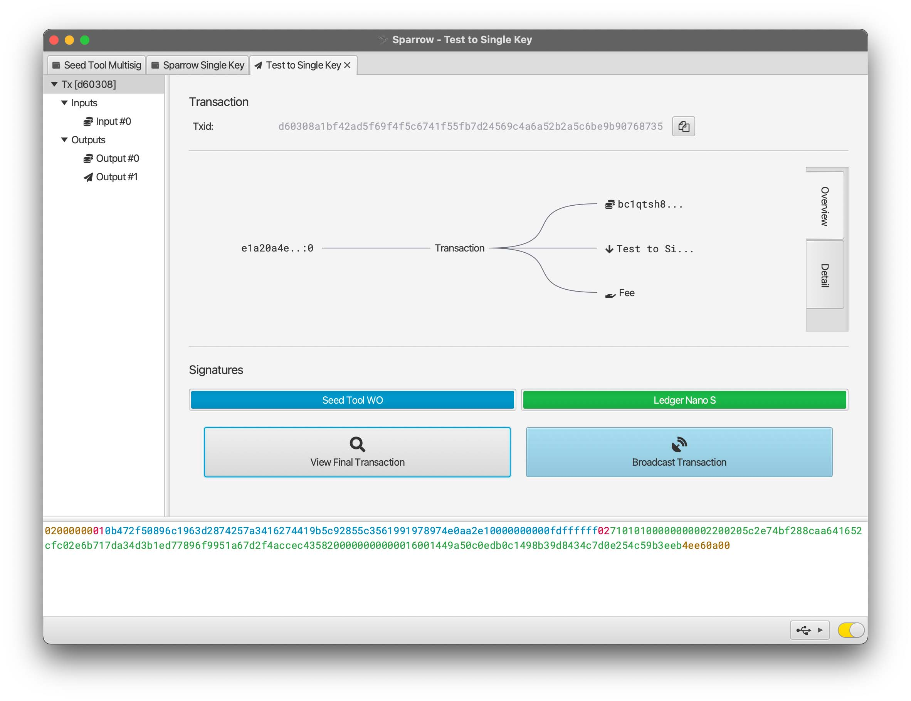

# Integrating Seed Tool with Other Apps

One of the primary goals of **Gordian Seed Tool** is to use it to store seeds which can then be used by separate wallets. This allows for the secure and resilient storage of your seeds while still maintaining high usability.

There are two primary ways to do this: a seed can be stored in **Gordian Seed Tool**, then specific key derivations can be released as needed; or the seed can be stored in Seed Tool and it can be used to sign PSBTs as required. The latter is more secure.

## Using Sparrow as a Transaction Coordinator

[Sparrow](https://sparrowwallet.com/) is a self-sovereign software wallet created by [Craig Raw](https://github.com/craigraw) that is using some of Blockchain Commons' [Uniform Resources](https://github.com/BlockchainCommons/crypto-commons/blob/master/Docs/ur-1-overview.md).

The following examples demonstrate how to use Sparrow Wallet as a "transaction coordinator", where it manages the usage of keys, including at least one held by **Seed Tool** and the receipt and sending of funds, but doesn't hold any keys itself.

### Creating a Multisig Address on Sparrow

One of the best methods of [#SmartCustody](https://github.com/BlockchainCommons/SmartCustody) is to create a multisig wallet where each key for the wallet is held securely. 

To do so in Sparrow, select the "Create New Wallet" button or choose "File->New Wallet" from the menu bar. Enter a name for the Wallet and then choose a "Multi Signature" policy with 2 of 3 M of N.

You can now create (or access) a seed in Seed Tool. View the seed and request the "Cosigner Public Key". This will give you a QR code for the `ur:crypto-hdkey` of the Cosigner derivation (`m/48'/0'/0'/2`) along with the fingerprint and that derivation path.

In Sparrow you can import this as your "Keystore 1", the first of the three keys that will lock your wallet:

1. Select "New or Imported Software Wallet"
2. Choose "xpub / Watch Only Wallet", to keep the seed and key in Seed Tool.
3. Enter the 8-digit master fingerprint and `m/48'/0'/0'/2` as the derivation
4. Click the camera button and view the QR code displayed by Seed Tool. This will translate the `ur:crypto-hdkey` into an `xpub`

Afterward, you will need to import or create two other seeds or HD keys as "Keystore 2" and "Keystore 3". Each of the key-storage devices should be physically separated. One method to do so is to use one or more hardware devices. This is easily done with hardware wallets, which can be connected to your computer and their keys imported as "Connected Hardware Wallet" or via newer "Airgapped Hardware Wallets" such Keystone or the Foundation Devices Passport.

Once you have imported these additional keys, you should see a descriptor something like the following:
```
 wsh(sortedmulti(2,SeedToolWO,TrezorT,LedgerNanoS))
```
You can then "Apply" to finalize your wallet. The "Receive" button will then reveal an address to which you can send funds.

At this point, you will generally want to separate your various key holders. If you used two hardware wallets with **Seed Tool** then you'll want to remove at least one of those hardware wallets (and maybe both, depending on how often you use transact Bitcoins) to secure, remote places. 

### Sending a PSBT on Sparrow

To create a transaction on Sparrow, you must choose to "Send" and enter basic info such as the address, a label, and the fee amount. You can then "Create Transaction" after which you can view information and be given the option to "Finalize Transaction for Signing". You'll then be brought to a page where you're given the option to sign the transaction.

If you used the above methodology for creating a multisig, then you'll need your phone (with **Seed Tool**) and one or your two hardware devices to do so.

To sign with **Seed Tool**:

1. On Sparrow: choose "Show QR". This will display an animated QR.

<a href="../images/sparrow-psbt-1.jpg"></a>
<a href="../images/sparrow-psbt-2.jpg"></a>

2. On Seed Tool: choose the QR icon at the top and "Scan" the animated QR. You will be told that there is a Signature Request. Reveal the details. Currently this is a `ur:crypto-psbt`, though we encourage developers to upgrade to `ur:crypto-request`.

<a href="../images/sparrow-psbt-3.jpg"></a>

3. On Seed Tool: choose "Approve".

<a href="../images/sparrow-psbt-4.jpg"></a>

4. On Seed Tool: if the request was a `ur:crypto-request`, choose the QR Code for `ur:crypto-response`, else if it was `ur:crypto-psbt`, send back a `ur:crypto-psbt`.

<a href="../images/sparrow-psbt-5.jpg"></a>
<a href="../images/sparrow-psbt-6.jpg"></a>

5. On Sparrow: close the box displaying the entirely unsigned PSBT and click "Scan QR" to click the QR you generated on Seed Tool after signing. After it reads in the animated PSBT, you should a box telling you that your transaction is signed by your Seed Tool key.

<a href="../images/sparrow-psbt-7.jpg"></a>

You can now input another signature; if you used the above methodology for creating a multisig, hook up the hardware device you have with your computer, and click "Sign" under the USB icon. (Remember that you may need to unlock your device with a PIN and/or choose the right app, depending on the precise hardware device.) Once you've found the right device, click "Sign". You will probably then need to review and OK the signature on the device.

<a href="../images/sparrow-psbt-8.jpg"></a>

Finally, you can "Broadcast Transaction" on Sparrow.
