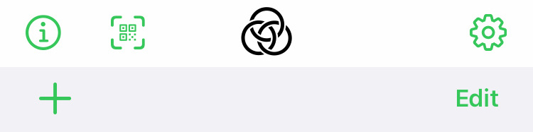
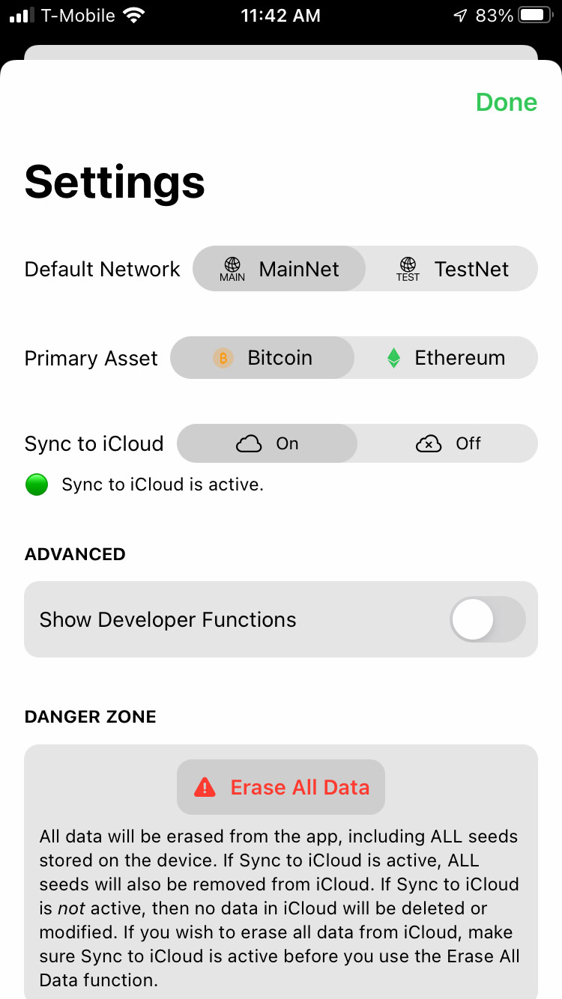
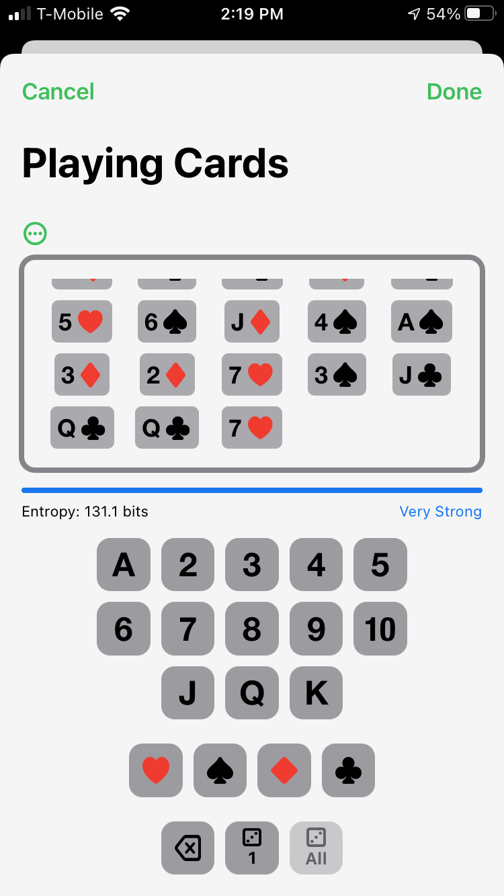
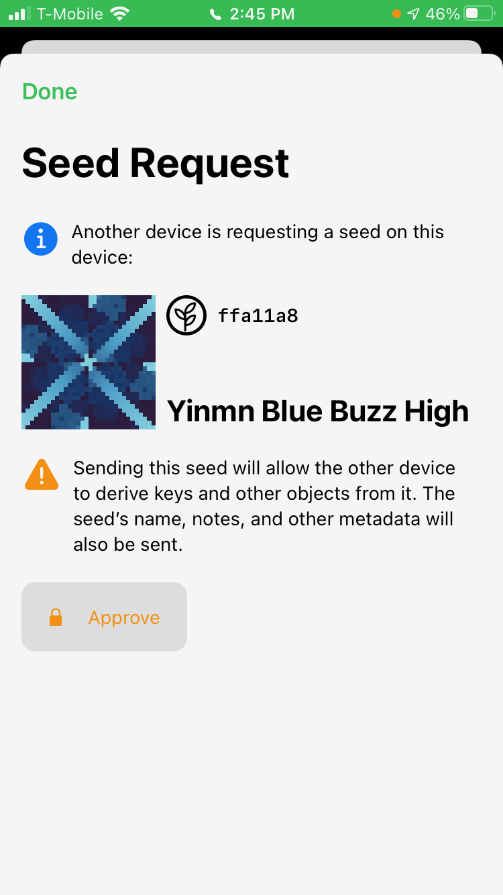
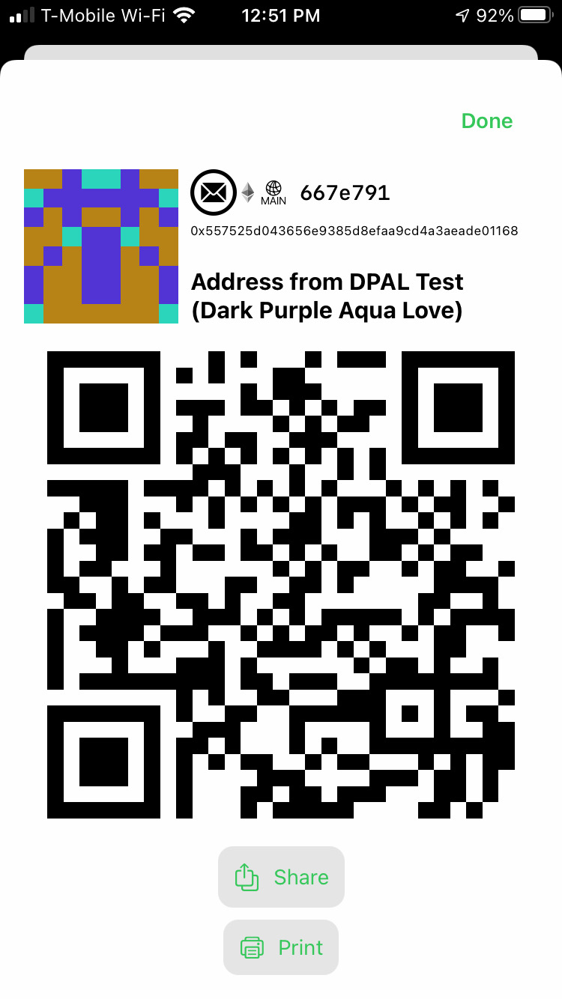

# Gordian Seed Tool Manual v1.4.0 (48)

**Gordian Seed Tool** is an iOS and macOS seed manager that is a reference app for the Gordian system. It allows you to safely and securely store your cryptographic seeds and to derive and export public keys, private keys, and descriptors for Bitcoin and private keys, public keys, and addresses for Ethereum. You can also backup or export the seed itself in a variety of forms, including as SSKR shares.

Why use **Seed Tool**? Because storing your seeds in the unecrypted RAM of a fully networked device is a major security vulnerability and also leaves your seeds vulnerable to loss. It's both a Single Point of Compromise and a Single Point of Failure. **Seed Tool** resolves both of these problems. You can move selected public and private keys online only as they're required, and you can be sure that your seeds are in a secure vault that's backed up and not dependent on a single device.

**Usability Features:**

* Import via QR or a variety of text specifications.
* Export via QR or Clipboard or printing.
* View & identify unique seeds using [Object Identity Blocks](https://github.com/BlockchainCommons/Research/blob/master/papers/bcr-2021-002-digest.md#object-identity-block).
* Sign using PSBTs.

**Security Features:**

* Stored Securely with Apple Encryption.
* Protected via 2FA: you must login in to your Apple account, then you must verify whenever you access private data.
* Automated iCloud backup and recovery.
* Optionally usable offline, not connected to any network.

**Gordian Seed Tool** is a reference app, demonstrating the [Gordian Principles](https://github.com/BlockchainCommons/GordianSeedTool-iOS#gordian-principles) of independence, privacy, resilience, and openness.

## Table of Contents

* [Installing Seed Tool](MANUAL.md#installing-seed-tool)

* [Using Seed Tool](MANUAL.md#using-seed-tool)
* [Adding a Seed](MANUAL.md#adding-a-seed)
* [Viewing a Seed](MANUAL.md#viewing-a-seed)
* [Using a Seed](MANUAL.md#using-a-seed)
* [Exporting a Seed](MANUAL.md#exporting-a-seed)
* [Deleting a Seed](MANUAL.md#deleting-a-seed)
* [Using Seed Tool for Transactions](MANUAL.md#using-seed-tool-for-transactions)

* [Appendix I: Threat Modeling](MANUAL.md#appendix-i-threat-modeling)
* [Appendix II: Other Tools](MANUAL.md#appendix-ii-other-tools)

## Installing Seed Tool

You can either purchase **Gordian Seed Tool** from the Apple store or you can compile from the source <a href="https://github.com/BlockchainCommons/GordianSeedTool-iOS/tags">using the newest release tag</a>.

For full functionality of the iCloud backup, be sure to turn on the following functionality under "Settings > Apple ID > iCloud" on all devices running **Gordian Seed Tool**:

* Keychain
* iCloud Drive

Be _very_ sure that all devices running **Gordian Seed Tool** are fully logged into your Apple account, with full access to iCloud, and switches set as noted above. Failure to do so will result in seed entries not being synced to the iCloud (or other devices).

Conversely, if you want to use Seed Tool on a network-isolated device, make sure the device is in Airplane Mode.

## Using Seed Tool

**Gordian Seed Tool** is a storage mechanism for seeds, particularly those used in cryptography systems. Seeds used in it will usually follow a three-part cycle.

1. **Add a Seed.** First, you must add seeds to the system. There are two ways to do so.
   * **Import a Seed.** You can import an existing seed that you generated in a cryptowallet.
   * **Create a Seed.** You can create a new seed.
2. **Store a Seed.** Your seed will be encrypted (and also backed up if you have iCloud enabled).
   * **View & Edit a Seed.** While a seed is stored in **Gordian Seed Tool**, you will be able to view it and change its metadata.
   * **Read an OIB.** Each seed (and key) comes with an Identity Block that makes it easy to identify.
3. **Use a Seed.** You can actively use a seed that is stored in **Gordian Seed Tool** without ever having to export it.
   * **Answer Seed Requests.** Seed Tool uses the [`crypto-request`/`crypto-response`](https://github.com/BlockchainCommons/Research/blob/master/papers/bcr-2021-001-request.md) system defined by Blockchain Commons for URs. This allows Seed Tool to export precisely what's needed by another app.
   * **Sign PSBTs.** Besides just exporting seeds or keys, you can also use your keys to sign PSBTs, responding to a `crypto-request` (or to a `crypto-psbt`, though this is not preferred).
   * **Derive a Key.** Alternatively, you can choose to export specific derived keys on your own, while keeping the seed in the app.
   * **Shard a Seed.** Finally, you can improve the resilience of your seed by sharding it with SSKR and giving out those shares.

The philosophy of **Gordian Seed Tool** is that once you've imported a seed you shouldn't need to ever export it. Nonetheless, you sometimes must in the modern-day, and that's supported by the following functions:

4. **Export a Seed.** You can export seeds using a variety of interoperable specifications.
5. **Delete a Seed.** You can also just delete a seed.

In the future we expect that more wallets will be able to participate with **Seed Tool** in a request/response cycle, both for derived child keys and with PSBTs needing signature.

The main functionality of **Seed Tool** is laid out in this manual to demonstrate its integration with Bitcoin, but **Seed Tool** also works with Ethereum, which causes some slight variations in functionality as explained in "Integrating with Ethereum".

### Viewing the Main Menu

<blockquote>
  
</blockquote>

The main menu of **Seed Tool** contains three buttons along the top in the menu bar:

* **Information** (circled "i"). Read documentation on all of the specifications and data types found in **Seed Tool**. (Info buttons linnking to specific questions are also available throughout the app.)
* **Scan** (qr code). Import a seed (see "Importing a Seed") or a `crypto-request` (see "Using a Seed") or a PSBT (see "Signing PSBTs") from a QR code; or import text from the Clipboard.
* **Settings** (gear). Change major ways in which the App works.

Below the main menu are options to **add** ("+") and **delete** ("edit") seeds followed by a list of each of your seeds, with each seed identified by an Object identity Block ("OIB"). You can click the right arrow on a seed to see more data about it and to export it.

### Adjusting Settings

The Settings page has five major options:

* **Default Network**. Choose "MainNet" or "TestNet". This is used for key derivation, especially as the network for the default "Cosigner Public Key" and "Cosigner Private Key" options. (Default: MainNet.)
* **Primary Asset**. Choose "Bitcoin" or "Ethereum". This is used for address generation and key derivation. (Default: Bitcoin)
* **Sync to iCloud**. Choose "On" or "Off". If "On", this exports your keys to your iCloud account, protected by a local encryption key. This ensures that you can restore your seeds to a new device if you lose your current one. (Default: On.)
* **Show Developer Function.** Choose "On" or "Off". If "On", this will show you example requests, responses, and other features of interest to developers. See "Viewing Developer Options". (Default: Off.)
* **Erase All Data.** Click to erase all data, including data on your local device and in iCloud (if iCloud Sync is "on"). Be very certain you want to do this!

> :warning: **WARNING:** We highly suggest you leave iCloud backups "On". Without them, if you lose your phone, you will lose all of your seeds. The iCloud backups are encrypted, so no one but you should be able to access them.

> :warning: **WARNING:** Deleting your seeds through the Settings function of "Erase All Data" will entirely remove them: they will be gone! Your cloud data will also be removed, presuming that you have "Sync to iCloud" set to "On".

## Adding a Seed

Seeds can be imported or created. Seed importing is done via either the Scan button (which imports via camera or other automated means) or the **add** button (which does so via cut-and-pasting) while seed Creation is done through the **add** ("+") button.

### Scanning a Seed via Automated Means

The **Scan** (qr code) button on the main menu provides the most automated methods for importing seeds, using your camera, the cut-and-paste clipboard, the file system, or your photo roll.

To scan a QR code, you can:
* Point your camera at the QR of a seed, using the circular "flip" symbol to switch between front-facing and back-facing cameras if needed; or
* Import a QR of a seed from your "Photos"; or
* Choose an image of a QR from your "Files".

To scan text:
* Copy it into your Clipboard and click "Paste."

Note that for these methodologies, **Seed Tool** expects the QR code or the clipboard to contain a [Uniform Resource](https://github.com/BlockchainCommons/Research/blob/master/papers/bcr-2020-005-ur.md), a standardized way to encode data in an efficient and self-identifying way. This will usually mean a [`ur:crypto-seed`](https://github.com/BlockchainCommons/Research/blob/master/papers/bcr-2020-006-urtypes.md#cryptographic-seed-crypto-seed).

Besides using the scan page to import seeds, you can also use it to import SSKR shares (See "Importing SSKR Shares"), to respond to a `ur:crypto-request` (see "Answering Seed Requests"), or to respond to PSBT signing requests (see "Signing PSBTs"), as described below.

### Importing a Seed via Cut and Paste

The **add** ("+") button below the main menu gives a number of options for creating seeds in **Seed Tool**, but it also lets you input text as hex bytes, [`ur:crypto-seed`](https://github.com/BlockchainCommons/Research/blob/master/papers/bcr-2020-006-urtypes.md#cryptographic-seed-crypto-seed), [Bytewords](https://github.com/BlockchainCommons/Research/blob/master/papers/bcr-2020-012-bytewords.md), or [BIP39 Mnemonic Words](https://github.com/bitcoin/bips/blob/master/bip-0039.mediawiki). In each case, you just choose the data type, type or paste the data, and then click "Done".

The following show examples of the data you might import for each data type:

* **Hex Bytes:** 59F2293A5BCE7D4DE59E71B4207AC5D2
* **`ur:crypto-seed`:** `ur:crypto-seed/oyadgdhkwzdtfthptokigtvwnnjsqzcxknsktdhpyljeda`
* **Bytewords:** hawk whiz diet fact help taco kiwi gift view noon jugs quiz crux kiln silk tied omit keno lung jade
* **BIP 39 Mnemonic Words:** fly mule excess resource treat plunge nose soda reflect adult ramp planet

Again, you can also add SSKR shares, as described below.

### Importing SSKR Shares

SSKR stands for Sharded Secret Key Reconstruction, a Blockchain Commons [specification](https://github.com/BlockchainCommons/Research/blob/master/papers/bcr-2020-011-sskr.md). It allows you to shard a secret (such as a seed) into a number of shares, and then reconstruct the secret from some number (threshold) of those seeds that's typically fewer than all of them. For example, you might shard a seed into three shares with a threshold of two. SSKR shares can be used in one of two ways:

***Self-sovereign key recovery.*** You store shares in multiple, safe places, such as: in [QR Tool](https://www.blockchaincommons.com/projects/Releasing-QRTool/), in your safety deposit box, in your home-office safe, and in a locked drawer at work.

***Social key recovery.*** You give out keys to friends and family who are physically separated and who store them securely.

In either case, if a seed is lost, a threshold of shares can be collected (either on one's own or from friends family) to reconstruct the seed.

**Gordian Seed Tool** can be used to collect together shares and reconstruct your seed. There are currently three ways to do so:

* **Scan: QRs.** Photograph QRs of SSKR shares until you have a threshold.
* **Scan: Paste Crypto-SSKR.** Paste `ur:crypto-sskr` of SSKR shares until you have a threshold.
* **Add: Shares.** Paste sufficient shares into the "add" box to meet a threshold

The `ur:crypto-sskr` specification, which can be used in the `Add` section, in the `Scan: Paste`, or encoded as a QR, look like this:

* ur:crypto-sskr/gobnbdaeadaevdbkclhseeehtldedikgpysoenreceeeeorofrwn
* ur:crypto-sskr/gobnbdaeadadrkhesefhjzdycypduokkjejponsayabguymwwnwz

The SSKR words, which can only be used in the `Add` section, look like this:

* tuna acid epic gyro gray tent able acid able frog cusp heat poem owls undo holy rich monk zaps cost brag loud fair dice idle skew iris beta tied
* tuna acid epic gyro gray tent able acid acid diet fact gala numb leaf fish toys kite cyan inky help keep heat inky song trip bulb flap yoga jazz

The **Scan** functionality is currently the more advanced of the two options, and so is the suggested methodology. It will allow you to photograph or paste individual shares, and will alert you to how many more are needed to meet the threshold and reconstruct the seed.

### Creating a Seed

**Gordian Seed Tool** can also be used to create new seeds. This is doing using the **add** (+) button on the main menu. There are four ways to do so:

* **Quick Create.** Depend on your mobile device's randomization to create a seed.
* **Coin Flips.** Flip coins and enter results.
* **Die Rolls.** Roll six-sided dice and enter results.
* **Card Draws.** Draw cards and enter results. (Be sure to replace cards and reshuffle as you draw, for the entropy calculation to be correct.)

The easiest of these methods is certainly the "Quick Create", but in that case you are depending on the randomization of your mobile device, and if there is ever an exploit revealed, you'll be forced to sweep all of your funds. Using coin flips, die rolls, or playing cards is perhaps more likely to create good entropy, and is less likely to have an exploit revealed, but you _must_ properly flip every coin, roll every die, or draw every card, no matter how tedious it is, and you must wait until you have at least 128 bits of entropy, which is considered "Very Strong". If you are not willing to do this, you should just "Quick Create" instead. Once you have a "Very Strong" amount of entropy, you should click the "Done" button, and then you'll be given the opportunity to "Save" your new seed.

The coin flipping, die rolling, and card drawing methods all have three buttons at the bottom, which allow you to: erase one entry (back arrow); use the randomizer to add one entry (a die with a "1"); or use the randomizer to add all of the entries (a die with an "all").

The usage of coin (binary) and die entropy in **Gordian Seed Tool** matches that of [**Ian Coleman's BIP-39 Mnemonic Code Converter**](https://iancoleman.io/bip39/), so you can check the results there if you want to be sure of a new seed you've created. Our card draw technique is not identical to his.

  <table border=0>
    <tr>
      <td>
        
         
<b>Coin Flips</b>

      
</td>
      <td>
        
         
<b>Die Rolls</b>

      
</td>
      <td>
        
         
<b>Card Draws</b>

      
</td>
    </tr>
  </table>

## Viewing a Seed

Once you have a seed in **Gordian Seed Tool** it will be safely encrypted, and it will be securely backed up to iCloud as long as you've enabled iCloud's access to Keychain and iCloud Drive: all devices logged into the same iCloud account will show the same seeds.

### Displaying & Editing a Seed

You can view additional details of a seed by clicking the seed on the main menu.  The resulting page will show you the OIB, the bit size, the resultant strength, and the creation date. You can also edit the "Name" and add "Notes".

This is also where you export information on the seed, either the public key, the private data, or the seed itself, as described in "Using a Seed" and "Exporting a Seed".

### Reading the OIB

Each seed is displayed with an [Object Identity Block (OIB)](https://github.com/BlockchainCommons/Research/blob/master/papers/bcr-2021-002-digest.md#object-identity-block), which can be seen on both the listing and view pages. It helps you to visually identify a seed.

An OIB contains the following elements:

* **LifeHash.** A [methodology](https://github.com/BlockchainCommons/lifehash.info/blob/master/README.md) for creating an evocative visual representation of data based on Conway's Game of Life. It makes it easy to recognize a seed at a glance.
* **Type.** An icon representing the type of data. On the listings and main views, this is a seed icon.
* **Name.** A human-readable name for the seed. As a default, **Seed Tool** chooses a one-or-two word phrase based on the dominant color of the LifeHash followed by two random Bytewords. When you edit a Name you can click the "die" icon to re-randomize those last two words.
* **Digest.** An abbreviated seven-character digest of the seed.

The LifeHash, the type, the digest, and all but the last two words in the default name should be identical anywhere that you import your seed to that uses the Blockchain Commons OIB specification. That will help you to know that your seed was accurately transmitted, and to ensure that you're working with the right seed.

OIBs are also displayed for various keys derived from your seed. They use different icons for the "type" and do not include a name, as seen in "Deriving a Key".

### Viewing Developer Functions

**Seed Tool** is an exemplar reference tool that is fully functional as a seed vault that can support responsible seed usage. It also provides functions to make it easier for developers to create apps of their own that embody the Gordian Principles. You can choose to enable these functions by selecting "Show Developer Functions" in the Settings.

There are currently three developer functions:

* **Show Example Request for this Seed.** Displays a `ur:crypto-request` that will request this seed. Available from the Seed view page.
* **Show Example Response for this Seed.** Displays a `ur:crypto-response` that answers a requests for this seed. Available from the "Encryped Data" area of the Seed view page.
* **Show Examples for a Derivation.** Displays requests and responses for keys and derivations. Available from the "Derive Key" page.

These functions allow developers to test `ur` interactions with other wallets, by providing the QR they would use to request a seed and also displaying the QR response, so that they can double-check their work.

## Using a Seed

The main power of **Gordian Seed Tool** is that you can permanently store your seeds there, and instead give out keys or sign PSBTs, as needed.

### Answering Seed Requests

The Blockchain Commons [`ur:crypto-request`/`ur:crypto-response` system](https://github.com/BlockchainCommons/Research/blob/master/papers/bcr-2021-001-request.md) specifies how one app can request a certain type of [UR-encoded data](https://github.com/BlockchainCommons/Research/blob/master/papers/bcr-2020-005-ur.md), and another app can send that requested data. **Gordian Seed Tool** is integrated with this standard: another app can request a seed or a specific derived key, and **Gordian Seed Tool** will send it (with your approval).

This is accomplished via the **Scan** (qr code) feature. Select it and import a QR code through camera, Photos, or File, or else read in a `crypto-request` through the Clipboard. You will be told what seed or key is being requested, and you can choose to approve it. If you do, you'll then be given a QR code that you can scan into the other app as the `ur:crypto-response`.

The biggest use of this function is to send a very specific derived key that the other app desires. Though Seed Tool lets you derive a few common kinds of keys from your seeds or to hand-enter less standard derivation paths, a `ur:crypto-request` allows another app access to _any_ key derived from your seed in a much simpler and more reliable fashion.

  <table border=0>
    <tr>
      <td>
        
         
<b>Seed Request</b>

      
</td>
      <td>
        
         
<b>Seed Response</b>

      
</td>
      <td>
        
         
<b>Key Request</b>

      
</td>
    </tr>
  </table>

### Signing PSBTs

The goal of **Gordian Seed Tool** is to demonstrate how a seed may be kept in a protective and closely held device, such as your phone, but still actively used. One way is to export specific key derivations when they're required, as demonstrated above. However a safer method is to have the seeds and their keys _never_ leave your device. You can do this by receiving transactions as PSBTs, signing those within Seed Tool, and then exporting the signed result.

This can be done by reading a `ur:crypto-request` via QR code or Clipboard or by reading a binary .psbt file.

When you read a PSBT, a summary will show the following information:

* **In.** The amount of Bitcoins used as inputs for the transaction.
* **Sent.** The amount of Bitcoins being sent somewhere else in the transaction.
* **Fee.** The amount of Bitcoins used to pay network fees.
* **Change.** The amount of Bitcoins returned on a change address.

There is also additional information on everything but the fee.

* **Inputs.** Describes the number of inputs, their addresses, and their values. Will also show the keys in your Seed Tool needed to sign the UTXO(s) used in the PSBT.
* **Outputs.** Lists the number of outputs, which will typically be a Change address and a Sent address.
   * **Change.** Reveals the address and amount of money being sent back as change, as well as the signatures that will be required for that new UTXO. (Signatures associated with keys in Seed Tool will be fully described; others will not.)
   * **Sent.** Displays the address the rest of the funds are being sent to.

If you like everything you read in the Summary and additional information, you can **Approve**.

> :warning: **WARNING:** Seed Tool also allows you read in PSBTs using the `ur:crypto-psbt` specification, either scanned as QRs or read as text. This is primarily offered for backward compatibility, since `ur:crypto-psbt` was released prior to `ur:crypto-request`. It is not suggested for actual usage beyond testing because `ur:crypto-psbt` does not provide the full context of a PSBT.

#### Outputting PSBTs

Obviously, once you have signed a PSBT, you will need to output it, so that you can pass it on to another app or Wallet, which can finish signing (if necessary) and/or send the transaction to the Bitcoin network.

Six options are available for exporting, each as a button.

* `ur:crypto-response` as a QR code. This can be read across an Airgap by another QR code reader.
* `ur:crypto-response` as a Share. See "Using Share Sheets" for this distribution method.
* `ur:crypto-psbt` as a QR Code. This is not recommended, as it is not the preferred methodology.
* `ur:crypto-psbt` as a Share. See "Using Share Sheets", but again this is not recommended.
* **Base-64** as a Share. This allows distribution of the base-64 encoding of the PSBT, see "Using Share Sheets".
* `.PSBT` as a Share. This allows the transmission of a binary `.psbt` file, see "Using Share Sheets".

  <table border=0>
    <tr>
      <td>
        
         
<b>PSBT Info I</b>

      
</td>
      <td>
        
         
<b>PSBT Info 2</b>

      
</td>
      <td>
        
         
<b>PSBT Output</b>

      
</td>
    </tr>
  </table>

Note that output PSBTs *may* be animated. This is required for larger PSBTs, such as those that have been signed by multiple people, because of limitations in the size of PSBTs. The airgapped wallet that is receiving the signed PSBT will need to be able to recognize animated QR codes; if it can't, export via another of the methods, such as base-64 or a binary .psbt file.

> :warning: **WARNING:** You can choose to read in a PSBT as a `ur:crypto-psbt`, sign it, and then output it as `ur:crypto-response`, but doing so is somewhat undefined as it the response will include a random ID and not be an answer to any particular `ur:crypto-request`. Many wallets following the UR specification will likely throw it out due to the lack of a matching ID. The best solution to this is to use `ur:crypto-request` instead of `ur:crypto-psbt` for the original signing request.

### Deriving a Key

If you want to use **Gordian Seed Tool** to derive a key without using a `ur:crypto-request` (and rather than doing your signing in **Seed Tool** using PSBTs), you can do so by selecting a seed, choosing to "Authenticate" the "Encrypted Data", and then clicking the "Derive Key" button. The "Other Key Derivations" option will allow you to derive keys on testnet or mainnet for: Master Keys, Cosigner keys (48'/0'/0'/2' for mainnet or 48'/1'/0'/2 for testnet), or Segwit keys (84'/0'/0' for mainnet or 84'/1'/0' for testnet). Simply click the "Derivation Preset" that you prefer. You can also enter a "Custom" derivation by hand.

These various derivations will output a variety of keys for you:

* Most Bitcoin derivations will output a private HD key, a public HD key, and an address.
* A Bitcoin master key outputs the typical keys and address and also allows you to ouput an Output Descriptor (as a text descriptor or `ur:crypto-output`) and an Account Descriptor (as `ur:crypto-account`). Be sure to touch the "Share" button for access to all the export options.

The seed view page also contains quick buttons that just say "Cosigner Public Key" (at the top) and "Cosigner Private Key" (under the "Derive Key" button in the Encrypted Data). They derive a public or private Bitcoin Cosigner Key, using either Mainnet or Testnet, as recorded in your **Settings**.

After deriving a key, you can export it by using a QR code, by sharing the text of the `ur:crypto-hdkey`, by sharing the text of the Base58 encoding (`xprv` for traditional keys, `zprv` for segwit keys),  or by printing.  Descriptors, addresses, and accounts can also be shared as QRs or as text. Just tap the appropriate button or touch-and-hold the element you want to share. For sharing text, see "Using Share Sheets" below.

  <table border=0>
    <tr>
      <td>
        
         
<b>Public Key</b>

      
</td>
      <td>
        
         
<b>Bitcoin Derivation</b>

      
</td>
      <td>
        
         
<b>Ethereum Derivation (see below)</b>

      
</td>
    </tr>
  </table>

Whenever you derive a key, you will be given a visual cue to remind you how much security is required by the key: export options for private keys appear in orange, while export options for public keys appear in green.

### Sharding a Seed

SSKR sharding allow you to make a backup of your key that's not easily susceptible to attacks. You shard your key, you give out the shares to friends and family (or maintain them in separate locations of your own), and then if you ever lose your key you can reconstruct it by recovering a threshold of shares.

To create SSKR shares of your seed, go to the seed view, "Authenticate" to access your "Encrypted Data" and choose "Backup". Then select the "Backup as SSKR Multi-Share" option. This will allow you to set a number of groups, a number of shares, and a number of thresholds You will usually leave the groups at one and just choose a number of shares (such as 3) and a threshold required to recover the seed (such as 2).

You can also choose a more complex methodology with SSKR's "groups", which allows you to define multiple groups, then to set a threshold of a certain number of shares from a certain number of groups: for example, you could create 3 groups, with a group threshold of 2, then have each group include 3 shares, with a threshold of 2. You'd then be able to recover your seed from 4 of the 9 shares, as long as 2 each come from 2 different groups. (But, this is more complex than most people will need: just do something simple like a 2 of 3 sharding or a 3 of 5 sharding if the group sharding sounds like something you wouldn't know how to use).

A number of default presets will probably suit you needs:

* **1 of 1:** A method for backing up your seed using just one share. It's very similar to backing up the Bytewords for the seed.
* **2 of 3:** Use this if you're not sure: it's probably the most common methodology. Place your three shares in three locations (or with three people) and then reconstruct by recovering two of them.
* **3 of 5:** An expansion of 2-of-3. If you've got more locations where you can store keys, or more friends, or both, or if you're a little less certain of the continued availability of any individual place or person, use this.
* **4 of 9:** A very large-scale sharding. This is most likely to be used in a corporate environment where different shares are kept by different personnel, but it could also be used by someone with a very large group of trusted friends.
* **2 of 3 shares, of two of three groups:** The complex "groups" situation described above, where you need two shares from two groups to recover. It may be more secure than a straight 4 of 9 because you can partition your keys to different groups of people to ensure that you can always recover and they can never collude.

A [Scenario Guide for SSKR Shares](https://github.com/BlockchainCommons/SmartCustody/blob/master/Docs/SSKR-Sharing.md) explains more about why to use a particular scenario and how to get the best use of it. But, again, if that's too much, just use a 2-of-3 and make sure that each of the shares is separated physically from the others.

#### Exporting the Shares

After you create your SSKR shares, you have to export them, to make them available either to the people you'll be giving them to or to other places where you want to store them. After you've created your SSKR shares, you can either: export the shares individually; print them jointly as QRs and Bytewords; export them jointly as ByteWords; or export them jointly as `ur-crypto-sskr`. You should answer the following questions to determine your favorite SSKR export method.

*Individually or Jointly?* The most secure way to export your SSKR shares is to do so individually, preferably by saving them to different MicroSD cards, as discussed in "Using Share Sheets", below. This ensures that your shares are never in the same place once they leave Gordian Seed Tool, which is the optimal security methodology.

*QR, UR, or ByteWords?* You can store the words (whether you're exporting them individually or jointly) using QR codes, URs, or Bytewords. We suggest QR codes as a first choice because they're very easy to scan back into compatible seed stores. URs are a second choice, but are still good because they're self-describing and self-verifying. Bare ByteWords may seem the most resilient, because they're words you can see, but they don't have the usability or resilience advantages of QRs or URs.

*To Print or Not to Print?* Printing is the most convenient export methodology. You can either print everything on one sheet (and cut apart individual "coupons") or use the default option to print a cover sheet and then individual sheets for each share. Individual sheets are chosen as the default because that allows you to keep the cover sheet to track where all the shares are, and to give out the shares  on full-sized sheets of paper, which are much less likely to get lost. The deficit of printing is that your shares could be compromised if your local network is compromised. We would suggest that you _never_ print sufficient shares to allow the theft of your digital assets. If you're just printing shares for one key in a multisig, no problem, but if you have shares for a single-key account, or if you want to backup multiple keys for a multisig, use another method such as the individual saves to MicroSD cards.

*How to Store?* We suggest asking recipients to store the QR code for your SSKR share [**Gordian QR Tool**](https://apps.apple.com/us/app/gordian-qr-tool/id1506851070) and then to thoroughly destroy the slip (or piece) of paper. The MicroSD storage methodology is another resilient digital means for storing SSKR shares, but we suggest doing new writes to your MicroSD at least once a year and replacing your MicroSD cards every three years. If you're not using digital storage, you need to make sure your physical storage is resilient. Etching words in steel is a tried and true methodology for Bitcoin word storage. At the least, print your words on waterproof paper.

  <table border=0>
    <tr>
      <td>
        
         
<b>SSKR Creation</b>

      
</td>
      <td>
        
         
<b>SSKR Export</b>

      
</td>
      <td>
        
         
<b>SSKR Print</b>

      
</td>
    </tr>
  </table>

Be sure that anyone receiving shares knows to return them only after receiving live visual or voice confirmation from you, and to send them via an encrypted channel, such as Signal. An in-person meeting is even better, because it resolves most threats that come about through the reconstruction of a seed. See [The Dangers of Secret-Sharing Schemes](https://github.com/BlockchainCommons/SmartCustody/blob/master/Docs/SSKR-Dangers.md) for why this is important.

### 2FAing Your Requests

Any time you request private data, such as your seed or private keys derived from your seed, **Gordian Seed Tool's** 2FA will go into effect.

The first factor was entered by you when you logged into your Apple ID the first time that you used **Seed Tool.**

The second factor is applied whenever you access private data, most frequently by choosing to "Authenticate" to access your Encrypted Data. Usually, you will enter a thumbprint, but on a newer iPhone you will use Face ID and on most Mac systems you will enter a password.

This ensures that even if someone acquires your device in an unlocked mode, they won't be able to get to your seed data.

## Exporting a Seed

You should be able to safely and securely use your seed within **Gordian Seed Tool** by responding to `ur:crypto-requests`, by signing PSBTs, and by deriving keys. However, if you want to some day export the whole seed, you can.

A seed can be exported by touching the "Authenticate" box under the "Encrypted Data" section of a seed. This will, as usual, require your 2FA. After it decrypts, you can then click the "Share" button. This will allow you to share as hex, as BIP39 Mnemonic Words, as ByteWords, or as a `ur:crypto-seed`.

**Human-Readable Exports:**
* **BIP39 Mnemonic Words:** The mostly widely used human-readable specification. Use this as a backup if you might need to later import the seed to an older wallet.
* **ByteWords:** Blockchain Commons' human-readable specification. It was constructed to maximize the ability to remember the words and to minimize the ability to confuse them. This is a preferred backup method if you'll later be importing into a modern wallet, such as a Gordian app.

**Computer-Readable Exports:**
* **Hex:** The mostly widely used computer-readable specification. Use this if you plan to export to an older wallet.
* **`ur:crypto-seed`:** Blockchain Commons' computer-readable specification. This is the best export method for modern wallets that support Uniform Resources, including Gordian apps, because it will also preserve metadata such as data of creation and notes.

These functions will all allow you to share your data as described in "Using Share Sheets", below.

> :warning: **WARNING:** Generally, you want to always keep your seeds in **Seed Tool**. A seed is both secure and resilient in the app. There is no reason to export it. Instead, sign PSBTs or export keys as appropriate — ideally watch-only public keys or specific derived keys in response to a `ur:crypto-request` from another app.

## Using Share Sheets

A Share Sheet pops up when you touch and hold certain elements (such as parts of the OIB or the QR code) or when you click certain 'share' buttons. This lets you share text or graphics for derived keys, SSKR shares, seeds, and PSBTs. This means that you can share them via a variety of standard methodologies, such as Airdrop, Messages, Mail, and other apps that offer sharing capabilities. We suggest sharing via an encrypted app, such as Signal. 

Note that if you scroll down you can also "Copy to Clipboard", "Save to Files", and "Print" for text and "Save Image" for graphics such as QR codes. Of these, "Save to Files" can be particularly powerful because it allows saving data to a backed up location, such as an iCloud drive, or even to an attached MicroSD card if you have an appropriate adapter. Obviously, you should be sure that any private information is only backed up to a secure location: MicroSD cards are a particularly good option.

  <table border=0>
    <tr>
      <td>
        
         
<b>Clipboard</b>

      
</td>
      <td>
        
         
<b>Print</b>

      
</td>
      <td>
        
         
<b>File</b>

      
</td>
    </tr>
  </table>

## Deleting a Seed

If you're done with a seed or if you've exported it to another app or device, you may then want to delete it.

Seeds can be deleted with the "Edit" function on the main page. You can immediately "Undo" a deletion (circle back arrow) if you deleted the wrong seed, and you can then "Redo" it (circle forward arrow), but as soon as you make any other change (such as adding a new seed or even resorting your seeds), any seed you deleted will be gone forever. Be careful!

  <table border=0>
    <tr>
      <td>
        
         
<b>Export</b>

      
</td>
      <td>
        
         
<b>Delete</b>

      
</td>
      <td>
        
         
<b>Undo Delete</b>

      
</td>
    </tr>
  </table>

You can also remove all seeds, including those in iCloud (assuming iCloud Sync is On), with the "Erase All Data" button in the Settings menu.

## Integrating with Ethereum

If you use seeds with Ethereum instead of Bitcoin, you can set that as your default view by choosing "Ethereum" as your "Primary Asset" under **Settings**.

This will cause some changes in functionality.

### Viewing a Seed

When you "View a Seed", you will see a new option for "Ethereum Address", which will reveal the Ethereum address associated with the seed.

### Exporting a Seed

When you choose to "Derive Key" from a Seed after you "Authenticate", you will see new options related to Ethereum.

1. Deriving an "Ethereum Private Key" will provide the standard Ethereum Private Key.
2. Choosing "Other Key Derivations" will allow you to derive a "Master Key", a "44'/60'/0'/0/0" derived key, or a custom derivation for Ethereum. Each choice will depict four options: Ethereum Private Key, Ethereum Address, Private HD Key, and Public HD Key.

  <table border=0>
    <tr>
      <td>
        
         
<b>Settings</b>

      
</td>
      <td>
        
         
<b>Address</b>

      
</td>
      <td>
        
         
<b>Derivations</b>

      
</td>
    </tr>
  </table>

### Reading the Blockies

For the Ethereum Private Key and Address, the "blockie" associated with the address is shown rather than a LifeHash. This is a [widely used specification](https://www.npmjs.com/package/ethereum-blockies) that much like LifeHash provides a visual representation, but in the case of the blockie, it is always associated with the Ethereum address.

## Using Seed Tool for Transactions

**Seed Tool** can be used to store seeds for live transactions by taking advantage of its `crypto-request`/`crypto-response` and PSBT capabilities. See [Integrating Seed Tool with Other Apps](Integration.md) for real-life examples of **Seed Tool** use.

## Appendix I: Threat Modeling

**Gordian Seed Tool** is built on a standard [#SmartCustody threat model](https://www.smartcustody.com/): the Gordian reference applications prioritize the management of risks and adversaries based on our assessment of the ones most likely to affect an average or sophisticated user in a first-world country. It focuses on the following #SmartCustody adversary categories:

* **Loss by Mistakes.** Making mistakes, particularly losing keys or seeds, is likely the main source of digital-asset loss for independent users. **Seed Tool** is thus all about resilience: protecting your keys from loss.
* **Loss by Acts of God.** The resilience of **Seed Tool** will also protect your seeds from many natural disasters, because they can be restored if your computing device is lost.
* **Loss by Theft.** There are many ways that your keys could be stolen, though these problems are more likely to affect large institutions. Nonetheless, **Seed Tool** helps to protect you against _external_ theft, particularly Network Attacks, by keeping your seeds in a closely held device. It does not necessarily protect against _internal_ theft, including Institutional Theft, which is discussed below.
* **Privacy-Related Problems.** **Seed Tool** gives some attention to privacy-related problems, as knowledge of your funds is protected by the app itself.

We have explicitly chosen "Loss by Institutional Theft" and "Loss by Government" as categories that we do not additionally guard against.

* **Loss by Institutional Theft.** To be specific, we trust the platform, which is currently Apple. We believe that their methods of encryption are not just secure, but also have a lower chance of systemic compromise than something that we might hand code. We additionally believe that their incentives for maintaining that security are much higher than any incentives to purposefully break it — and that they've proven that in the past through stand-offs with spy agencies.
* **Loss by Government.** Though we don't necessarily trust the government, we do believe that digital assets would be the least of one's problems if a government were acting against an individual. We say this with a caveat: our risk model presumes a law-abiding non-authoritarian government. That means that our risk model, and thus our reference apps, may not be secure in an authoritarian regime, such as in China where [Apple has been required to store iCloud data within the country](https://www.datacenterknowledge.com/apple/apples-icloud-china-set-move-state-controlled-data-center), making it vulnerable to covert or overt seizure.

Usage of specific features could cause the activation of other threats:

* **Loss through Convenience.** We have chosen some features that introduce a Convenience threat, where we potentially decrease the security of **Seed Tool** in order to increase its usability. One of these Convenience threats comes about through the use of the Clipboard to transmit key material. We consider this a minor threat as other apps can read the Clipboard; with Universal Clipboard enabled, this can even be the case for apps on your other machines logged in to the same iCloud account. Similarly, the Share Sheets allow sharing via methodologies that may not be secure, such as Mail and Messages. If you consider Clipboard a larger threat, do not use it to import key material, instead depending on hand entry or use of the Camera. When sharing via the Share Sheets, you should use methods that are encrypted and safe, such as Signal.
* **Loss through Personal Network Attack.** The gathering of shares to reconstruct a seed _always_ represents a threat where someone might steal and use your seed before or as you reconstruct it, as discussed in [The Dangers of Secret-Sharing Schemes](https://github.com/BlockchainCommons/SmartCustody/blob/master/Docs/SSKR-Dangers.md). An adversary could intercept your shares as they're being returned (so use an encrypted channel, or do it in person), and an adversary could compromise the computer where you're reconstructing the seed (so do it on an offline device, if possible).

## Appendix II: Other Tools

Power users may wish to use our command-line tools for manipulating seeds.

* [**seedtool-cli.**](https://github.com/BlockchainCommons/seedtool-cli) — A CLI tool for generating seeds and outputting them in a variety of formats.
* [**keytool-cli.**](https://github.com/BlockchainCommons/keytool-cli) — A CLI tool for deriving a variety of keys from a seed.
