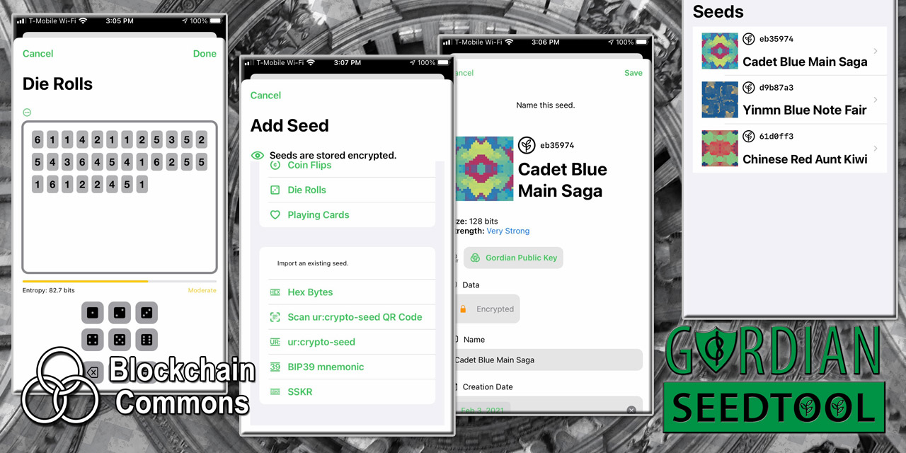
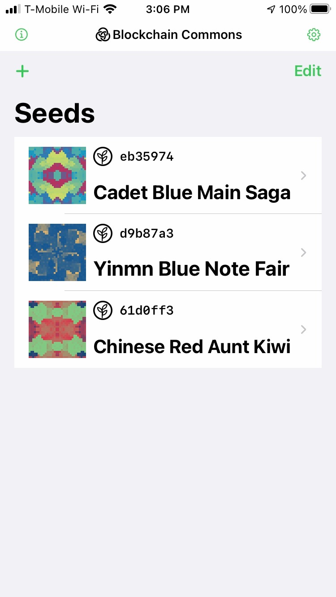
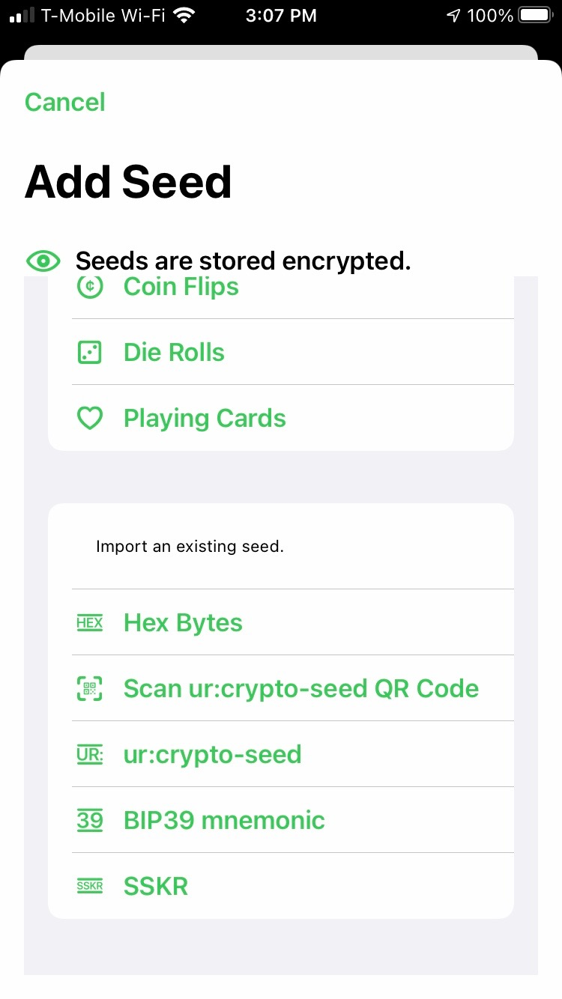
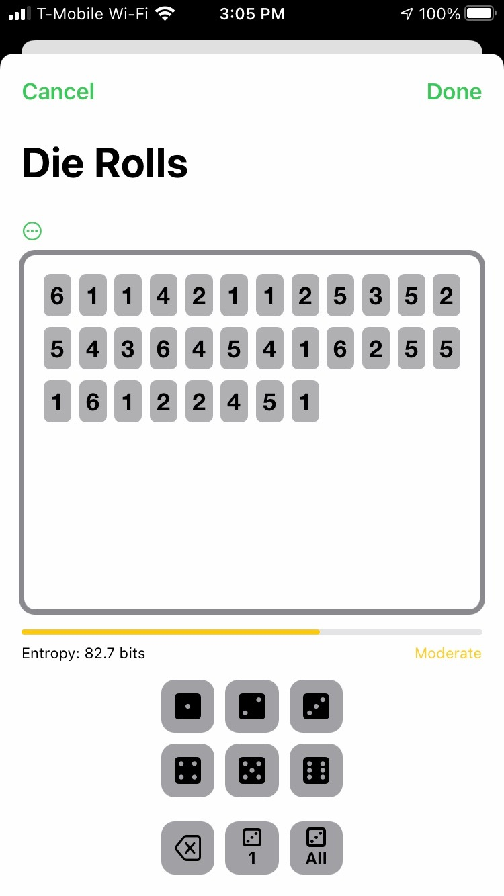
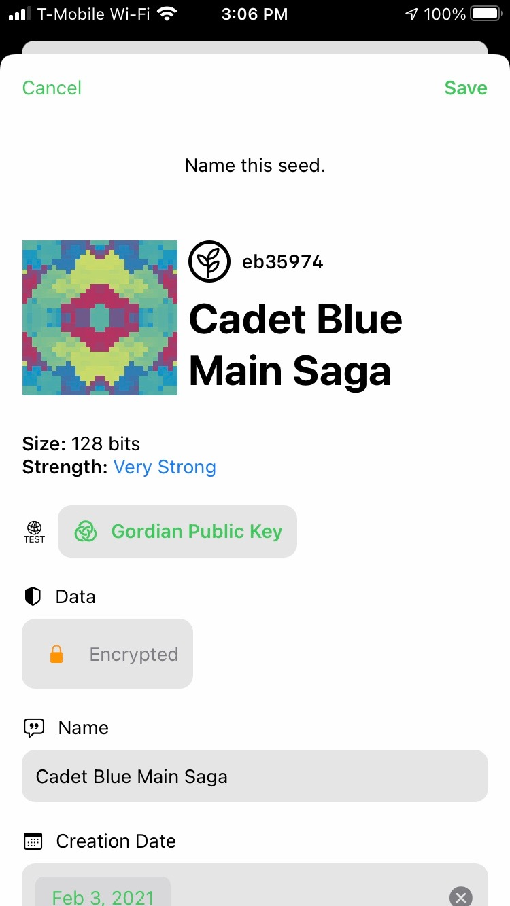

# Gordian Seed Tool

## Gordian Seed Tool Cryptographic Seed Manager for iOS

### _by [Wolf McNally](https://www.github.com/wolfmcnally) and [Christopher Allen](https://www.github.com/ChristopherA)_
* &nbsp;&nbsp; ***part of the [crypto commons](https://github.com/BlockchainCommons/crypto-commons/blob/master/README.md) technology family***

**`Gordian Seed Tool`** is an iOS-based seed manager that is a reference app for the Gordian system.

&nbsp;&nbsp;&nbsp;&nbsp;&nbsp;&nbsp;

## Installation Instructions

**Gordian Seed Tool** is available from the [Apple Appstore for the iPhone](https://apps.apple.com/us/app/gordian-seed-tool/id1545088229), or can be compiled from source here.

To compile from source, simply choose "Code > Open with Xcode" from the top of the repo. This will download the code into Xcode, including all of the dependencies. After you will be able to _Run_ (command-R) it for your Mac or a connected iOS device.

## Usage Instructions

## Gordian Principles

**Gordian Seed Tool** is a reference implementation meant to display the [Gordian Principles](https://github.com/BlockchainCommons/Gordian#gordian-principles), which are philosophical and technical underpinnings to Blockchain Commons' Gordian technology. This includes:

* **Independence.** Seed Tool allows you to maintain personal control of your cryptographic key material.
* **Privacy.** Seed Tool ensures your privacy because everything is on your closely held mobile device.
* **Resilience.** Seed Tool uses 2FA by combining an Apple login with biometric authentication. It securely backs up your material to iCloud.
* **Openness.** Cosigner communicates through airgaps via URs and QRs, for maximum interoperability.

Blockchain Commons apps do not phone home and do not run ads. Some are available through various app stores; all are available in our code repositories for your usage.

# Status - Released (1.1)

**Gordian Seedtool** has been released through the [Apple Appstore](https://apps.apple.com/us/app/gordian-seed-tool/id1545088229).

## Version History

### 1.2 (26), July 28, 2021

* In the Export SSKR display, removed export individual shares views. Since the SSKR generated is ephemeral, it wasn't really useful to conditionally show each one. You can now only share or print all the generated shares at once.
* The last preset in the SSKR export display is now called, "2 of 3 shares, of two of three groups".
* In the Derive Key view, both the private and public keys are now simulatenously derived, so a separate parameter for Key Type (i.e., private or public) is no longer necessary.
* In the Derive Key view, selecting Ethereum as the asset type now only allows master key derivations.
* In the Derive Key view, the share buttons for the derived public and private keys are no longer popup menus: they take you directly the the Key Export view, which shows all the export options including the QR code, print button, share as Base58. If Developer Functions are turned on in Settings, then buttons to show sample requests and responses are also visible here.
* The Share as Base58 function in the Key Export view now includes the master key fingerprint and derivation path along with the Base-58 key.

### 1.2 (25), July 27, 2021

This is a preview testing release of what will become version 1.2. It does not yet include the full set of planned features to be release with 1.2.

* You can now navigate from various places of the app to specific pages of the built-in user's guide via the ⓘ buttons.
* The Settings panel now contains a Show Developer Functions switch that shows the "Show Request/Response for this Seed/Key" options at appropriate places in the app.
* All functions that copied data to the clipboard, including long presses on QR codes, life hashes, and other static fields, now invoke the system share sheet instead. The downside to this is that the "Copy" function in the share sheet does not automatically expire the clipboard contents after a minute. It *might* be possible to add this as an app-specific function in the share sheet.
* In the Seed Detail view, the "Data" section has been renamed "Encrypted Data", and the "Decrypt" button is now called "Authenticate". It now reveals several buttons: Backup, Share, and Derive Key, which are menus that lead to futher functionality. There are also links to the documentation. This was done to make the many functions that authentication reveals more discoverable and intuitive. 
* The SSKR export view now includes a "preset selector" that lets users choose among comon sharding configurations. Users can still choose any configuration they like and this will be reflected in the preset selector as "custom".
* The "Next" button in the SSKR Export view has been moved from the bottom of the form to the top right of the view.
* All "Done" buttons are now consistently in the upper-right corner of their views.
* In the Settings panel, the default network is now "mainnet". This will only apply to users who have not manually changed this setting. 
* "Allows Further Derivation" has been removed from Key Export parameters, as it's an advanced feature not likely to be used by many users, and leaving it in was causing confusion.
* Fixed: Text in SSKR heads-up display in Scan View should always be white. Currently it is black when the phone is not in Dark Mode.

### 1.1 (24), July 13, 2021

* More detailed diagnostic messages when pasting SSKR fails.
* Scan view can now pick image(s) from document picker or photos picker.
* Added textual UR to Seed, HDKey, and SSKR print pages.

### 1.0.1 (23), July 7, 2021

* Added support on the macOS version for Print to PDF.

### 1.0.1 (22), July 7, 2021

* Fixed issues [#59](https://github.com/BlockchainCommons/GordianSeedTool-iOS/issues/59), [#60](https://github.com/BlockchainCommons/GordianSeedTool-iOS/issues/60), [#62](https://github.com/BlockchainCommons/GordianSeedTool-iOS/issues/62)

See [Version History](VERSIONS.md) for previous builds.

## Origin, Authors, Copyright & Licenses

Unless otherwise noted (either in this [/README.md](./README.md) or in the file's header comments) the contents of this repository are Copyright © 2020 by Blockchain Commons, LLC, and are [licensed](./LICENSE) under the [spdx:BSD-2-Clause Plus Patent License](https://spdx.org/licenses/BSD-2-Clause-Patent.html).

In most cases, the authors, copyright, and license for each file reside in header comments in the source code. When it does not, we have attempted to attribute it accurately in the table below.

This table below also establishes provenance (repository of origin, permalink, and commit id) for files included from repositories that are outside of this repo. Contributors to these files are listed in the commit history for each repository, first with changes found in the commit history of this repo, then in changes in the commit history of their repo of their origin.

| File      | From                                                         | Commit                                                       | Authors & Copyright (c)                                | License                                                     |
| --------- | ------------------------------------------------------------ | ------------------------------------------------------------ | ------------------------------------------------------ | ----------------------------------------------------------- |
| exception-to-the-rule.c or exception-folder | [https://github.com/community/repo-name/PERMALINK](https://github.com/community/repo-name/PERMALINK) | [https://github.com/community/repo-name/commit/COMMITHASH]() | 2020 Exception Author  | [MIT](https://spdx.org/licenses/MIT)                        |

### Dependencies

To build  `Gordian Seed Tool` you'll need to use the following tools:

- Xtools with Swift (or another Swift compiler)

### Derived from....

`Gordian Seed Tool` incorporates:
 * [BCLibsSwift](https://github.com/BlockchainCommons/BCLibsSwift) and thus a variety of [crypto commons](https://github.com/BlockchainCommons/crypto-commons/blob/master/README.md) libraries.

### Related to...

Blockchain Commons has two other seedtools:

* [LetheKit](https://github.com/BlockchainCommons/bc-lethekit) — Our DIY hardware project contains a seedtool.
* [seedtool-cli](https://github.com/BlockchainCommons/bc-seedtool-cli) — A command-line version of seedtool.

We also have other related projects:

* [keytool-cli](https://github.com/BlockchainCommons/keytool-cli) — A command-line tool for a wide variety of key derivations.

## Financial Support

`Gordian Seed Tool` is a project of [Blockchain Commons](https://www.blockchaincommons.com/). We are proudly a "not-for-profit" social benefit corporation committed to open source & open development. Our work is funded entirely by donations and collaborative partnerships with people like you. Every contribution will be spent on building open tools, technologies, and techniques that sustain and advance blockchain and internet security infrastructure and promote an open web.

To financially support further development of `Gordian Seed Tool` and other projects, please consider becoming a Patron of Blockchain Commons through ongoing monthly patronage as a [GitHub Sponsor](https://github.com/sponsors/BlockchainCommons). You can also support Blockchain Commons with bitcoins at our [BTCPay Server](https://btcpay.blockchaincommons.com/).

## Contributing

We encourage public contributions through issues and pull requests! Please review [CONTRIBUTING.md](./CONTRIBUTING.md) for details on our development process. All contributions to this repository require a GPG signed [Contributor License Agreement](./CLA.md).

### Discussions

The best place to talk about Blockchain Commons and its projects is in our GitHub Discussions areas.

[**Gordian System Discussions**](https://github.com/BlockchainCommons/Gordian/discussions). For users and developers of the Gordian system, including the Gordian Server, Bitcoin Standup technology, QuickConnect, and the Gordian Wallet. If you want to talk about our linked full-node and wallet technology, suggest new additions to our Bitcoin Standup standards, or discuss the implementation our standalone wallet, the Discussions area of the [main Gordian repo](https://github.com/BlockchainCommons/Gordian) is the place.

[**Wallet Standard Discussions**](https://github.com/BlockchainCommons/AirgappedSigning/discussions). For standards and open-source developers who want to talk about wallet standards, please use the Discussions area of the [Airgapped Signing repo](https://github.com/BlockchainCommons/AirgappedSigning). This is where you can talk about projects like our [LetheKit](https://github.com/BlockchainCommons/bc-lethekit) and command line tools such as [seedtool](https://github.com/BlockchainCommons/bc-seedtool-cli), both of which are intended to testbed wallet technologies, plus the libraries that we've built to support your own deployment of wallet technology such as [bc-bip39](https://github.com/BlockchainCommons/bc-bip39), [bc-slip39](https://github.com/BlockchainCommons/bc-slip39), [bc-shamir](https://github.com/BlockchainCommons/bc-shamir), [Sharded Secret Key Reconstruction](https://github.com/BlockchainCommons/bc-sskr), [bc-ur](https://github.com/BlockchainCommons/bc-ur), and the [bc-crypto-base](https://github.com/BlockchainCommons/bc-crypto-base). If it's a wallet-focused technology or a more general discussion of wallet standards,discuss it here.

[**Blockchain Commons Discussions**](https://github.com/BlockchainCommons/Community/discussions). For developers, interns, and patrons of Blockchain Commons, please use the discussions area of the [Community repo](https://github.com/BlockchainCommons/Community) to talk about general Blockchain Commons issues, the intern program, or topics other than the [Gordian System](https://github.com/BlockchainCommons/Gordian/discussions) or the [wallet standards](https://github.com/BlockchainCommons/AirgappedSigning/discussions), each of which have their own discussion areas.

### Other Questions & Problems

As an open-source, open-development community, Blockchain Commons does not have the resources to provide direct support of our projects. Please consider the discussions area as a locale where you might get answers to questions. Alternatively, please use this repository's [issues](./issues) feature. Unfortunately, we can not make any promises on response time.

If your company requires support to use our projects, please feel free to contact us directly about options. We may be able to offer you a contract for support from one of our contributors, or we might be able to point you to another entity who can offer the contractual support that you need.

### Credits

The following people directly contributed to this repository. You can add your name here by getting involved. The first step is learning how to contribute from our [CONTRIBUTING.md](./CONTRIBUTING.md) documentation.

| Name              | Role                | Github                                            | Email                                 | GPG Fingerprint                                    |
| ----------------- | ------------------- | ------------------------------------------------- | ------------------------------------- | -------------------------------------------------- |
| Christopher Allen | Principal Architect | [@ChristopherA](https://github.com/ChristopherA) | \<ChristopherA@LifeWithAlacrity.com\> | FDFE 14A5 4ECB 30FC 5D22  74EF F8D3 6C91 3574 05ED |
| Wolf McNally      | Project Lead        | [@WolfMcNally](https://github.com/wolfmcnally)    | \<Wolf@WolfMcNally.com\>              | 9436 52EE 3844 1760 C3DC  3536 4B6C 2FCF 8947 80AE |

## Responsible Disclosure

We want to keep all of our software safe for everyone. If you have discovered a security vulnerability, we appreciate your help in disclosing it to us in a responsible manner. We are unfortunately not able to offer bug bounties at this time.

We do ask that you offer us good faith and use best efforts not to leak information or harm any user, their data, or our developer community. Please give us a reasonable amount of time to fix the issue before you publish it. Do not defraud our users or us in the process of discovery. We promise not to bring legal action against researchers who point out a problem provided they do their best to follow the these guidelines.

### Reporting a Vulnerability

Please report suspected security vulnerabilities in private via email to ChristopherA@BlockchainCommons.com (do not use this email for support). Please do NOT create publicly viewable issues for suspected security vulnerabilities.

The following keys may be used to communicate sensitive information to developers:

| Name              | Fingerprint                                        |
| ----------------- | -------------------------------------------------- |
| Christopher Allen | FDFE 14A5 4ECB 30FC 5D22  74EF F8D3 6C91 3574 05ED |

You can import a key by running the following command with that individual’s fingerprint: `gpg --recv-keys "<fingerprint>"` Ensure that you put quotes around fingerprints that contain spaces.
